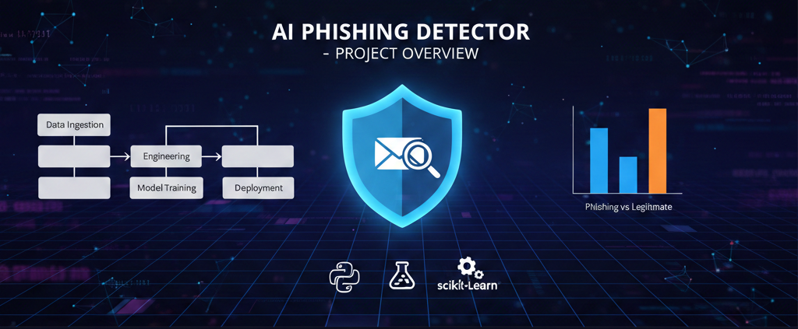

# AI Phishing Detector

This repository contains an experimental implementation of an AI-based phishing detection system. It combines header analysis, content intent, URL inspection, and attachment features to classify emails.


## Structure

- `src/phishdetector/` - core modules
- `data/` - raw and processed datasets
- `tests/` - unit tests

## Getting Started

1. Create a Python virtual environment and install dependencies:
   ```sh
   python -m venv venv
   venv\Scripts\activate    # Windows
   pip install -r requirements.txt
   ```
2. Place datasets in `data/raw` and run training scripts:
   ```sh
   python -m src.phishdetector.train
   ```

## Components

- `data_ingest.py` - load and clean raw email data
- `features.py` - feature extraction logic
- `model.py` - model definitions and training utilities
- `train.py` - orchestrates training pipeline
- `evaluate.py` - evaluation metrics and reports
- `deploy.py` - sample inference/service code

More detailed documentation will be added as the project evolves.

---

## Data Format

Raw email files should be placed under `data/raw` and may be CSV or JSON lines. Each record must include at least the following fields:

```json
{
  "sender": "phisher@example.com",
  "display_name": "Support Team",
  "subject": "Urgent: verify your account",
  "body": "Please click the link to reset your password...",
  "is_phish": 1
}
```

Additional columns such as `urls`, `attachments`, `spf_pass`, etc. are supported by feature modules.

## Example Workflow

1. **Prepare data**: collect and label emails in `data/raw`. A small `sample_emails.csv`/example is provided for testing.
2. **Train**:
   ```sh
   python -m src.phishdetector.train --input data/raw/emails.csv --label is_phish --output models/phish_model.pkl
   ```
3. **Evaluate** (either via Python or CLI):
   ```python
   from phishdetector import evaluate, model, features, data_ingest
   df = data_ingest.load_emails('data/raw/test.csv')
   X = features.assemble_features(df)
   clf = joblib.load('models/phish_model.pkl')
   evaluate.evaluate_model(clf, X, df['is_phish'])
   ```
   or on the command line:
   ```sh
   python -m src.phishdetector.evaluate --model models/phish_model.pkl --data data/raw/test.csv
   ```
4. **Deploy/Infer** (API or batch):
   ```sh
   # start REST server
   python -m src.phishdetector.deploy models/phish_model.pkl --serve

   # or score a file
   python -m src.phishdetector.deploy models/phish_model.pkl --input data/raw/sample_emails.csv --output data/processed/scored.csv
   ```

**Web interface**: once the server is running (`--serve`), open your browser to `http://localhost:5000`. The interface relies on Flask to serve CSS/JS assets; opening `index.html` directly with a `file://` URL may show layout issues or missing scripts. Always use the server for full functionality. The UI lets you:

- Read a concise **About** blurb explaining what the project does and why it exists
- Enter sender/display/subject/body and receive a **phishing probability** along with a detailed table of features.
- View a live **history of recent scores** and a plot of phishing probabilities (Chart.js) to gauge trends.
- Upload a CSV/JSON file for **batch scoring**; the server will save a scored file and display its location.

Design highlights:

- Compact, modern cyber‑security theme with subtle tech‑pattern overlay and animated particle background.
- Dark color palette with neon accent used for buttons and icons.
- Navbar with smooth scrolling links and fixed header, minimal padding for a sleek profile.
- Hero section resized for smaller screens; fonts and containers scaled appropriately.
- Feature cards are compact, with smaller icons and tighter spacing.
- Tooltips on form fields provide contextual help.
- Back-to-top button for easy navigation.
- Responsive, mobile‑friendly layout built with Bootstrap and AOS (animate on scroll).
- Footer and branding styled for minimal footprint.

You can still POST JSON to `/predict` if you prefer programmatic access.

**Batch scoring endpoint**: POST a CSV or JSON file to `/batch` (e.g. via curl or the web form) and the service will return the path to a scored file in `data/processed`.

POST JSON to `http://localhost:5000/predict` to get a phishing probability or use batch CLI above.

## Running Tests

Basic unit tests and functional tests live in the `tests/` directory. We use `pytest`:

```sh
pip install pytest
pytest
```

## Extending the Project

- Add new feature modules under `src/phishdetector/features.py` or create new files for structured features (e.g., `urls.py`, `attachments.py`).
- Implement more sophisticated models in `model.py` or add new training scripts.
- Use a feature store and experiment tracker (MLflow, DVC) for production work.

## Contribution Guidelines

1. Fork the repository.
2. Create a feature branch and add tests for new functionality.
3. Open a pull request describing your changes.

---


Thank you for using the AI Phishing Detector project!


